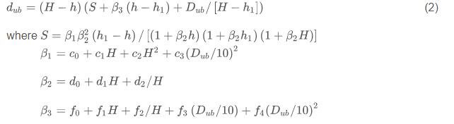

# Literature search

## ArticleID:
PubblicationYear:
Authors:
Title:
Source:
URL:

Function
Species:
Code
```{r}
plot(cars)
```


PROVA CHIARA prova matteo

=======

## ArticleID:
PubblicationYear:
Authors:Scolforo, H.F., McTague, J.P., Raimundo, M.R., Weiskittel, A., Carrero, O., Scolforo, J.R.S.
Title: Comparison of taper functions applied to eucalypts of varying genetics in Brazil: Application and evaluation of the penalized mixed spline approach
Source:(2018) Canadian Journal of Forest Research, 48 (5), pp. 568-580, DOI: 10.1139/cjfr-2017-0366
URL:https://www.scopus.com/inward/record.uri?eid=2-s2.0-85046101611&doi=10.1139%2fcjfr-2017-0366&partnerID=40&md5=6ca12aa51842a6a8d86630c3e88d440f
Function
Species: Eucalypts
Code
```{r}
plot(cars)
```

## ArticleID:
PubblicationYear: 2016
Authors: Andrew J. Warner, Monton Jamroenprucksa, Ladawan Puangchit,
Title: Development and evaluation of teak (Tectona grandis L.f.) taper equations in northern Thailand,
Source: Agriculture and Natural Resources, Volume 50, Issue 5, Pages 362-367, ISSN 2452-316X,
URL: https://doi.org/10.1016/j.anres.2016.04.005.
(http://www.sciencedirect.com/science/article/pii/S2452316X16302459)

Function
Species: Tectona grandis L.f.
Code : 2016WarnerEtAl.png
```{r}
plot(cars)

```
=======
```


## ArticleID:
PubblicationYear:2016
Authors: Andrew J. Warner, Monton Jamroenprucksa, Ladawan Puangchit,Title: Development and evaluation of teak (Tectona grandis L.f.) taper equations in northern Thailand,
Title: Development and evaluation of teak (Tectona grandis L.f.) taper equations in northern Thailand,
Source: Agriculture and Natural Resources, Volume 50, Issue 5, Pages 362-367, ISSN 2452-316X,
URL:  https://doi.org/10.1016/j.anres.2016.04.005.
(http://www.sciencedirect.com/science/article/pii/S2452316X16302459)

Function
Species: Tectona grandis L.f.

Code : 

```{r}
plot(cars)
```

