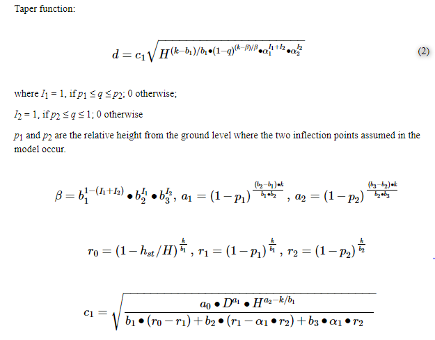

## ArticleID:001
Student:   
PubblicationYear: 2017  
Authors: Scolforo, H.F., McTague, J.P., Raimundo, M.R., Weiskittel, A., Carrero, O., Scolforo, J.R.S.  

Title: Comparison of taper functions applied to eucalypts of varying genetics in Brazil: Application and evaluation of the penalized mixed spline approach  
Source: (2018) Canadian Journal of Forest Research, 48 (5), pp. 568-580, DOI: 10.1139/cjfr-2017-0366  
URL: https://www.scopus.com/inward/record.uri?eid=2-s2.0-85046101611&doi=10.1139%2fcjfr-2017-0366&partnerID=40&md5=6ca12aa51842a6a8d86630c3e88d440f  

Function
Species: Eucalypts
Code

## ArticleID:002
Student: Angelo Manca
PubblicationYear:2016
Authors: Andrew J. Warner, Monton Jamroenprucksa, Ladawan Puangchit,

Title: Development and evaluation of teak (Tectona grandis L.f.) taper equations in northern Thailand,
Source: Agriculture and Natural Resources, Volume 50, Issue 5, Pages 362-367, ISSN 2452-316X,
URL:  https://doi.org/10.1016/j.anres.2016.04.005.
(http://www.sciencedirect.com/science/article/pii/S2452316X16302459)

Function
Species: Tectona grandis L.f.

Code : 

``
## ArticleID:003
Student: 
PubblicationYear:2016
Authors:Xiaolu Tang,César Pérez-Cruzado,Lutz Fehrmann,Juan Gabriel Álvarez-González,Yuanchang Lu,and Christoph Kleinn,

Title:Development of a Compatible Taper Function and Stand-Level Merchantable Volume Model for Chinese Fir Plantations
Source:Rongling Wu, Editor
URL:https://www.ncbi.nlm.nih.gov/pmc/articles/PMC4723312/

Function
Species:Cunninghamia lanceolata [Lamb.] Hook

Code: 

## ArticleID:004
Student: Maria Chiara Ruggiu
PubblicationYear: 2017
Authors:José Javier Corral-Rivas, Daniel Jose Vega-Nieva, Roque Rodríguez-Soalleiro, Carlos Antonio López-Sánchez, Christian Wehenkel, Benedicto Vargas-Larreta, Juan Gabriel Álvarez-González and Ana Daría Ruiz-González.

Title: "Compatible System for Predicting Total and Merchantable Stem Volume over and under Bark, Branch Volume and Whole-Tree Volume of Pine Species""

Source:Forests 2017, Volume 8, Issue 11, 417, MDPI AG
URL:https://doi.org/10.3390/f8110417

Function

Species: Pinus cooperi, Pinus durangensis

Code: 

## ArticleID: 005
Student: Matteo Piccolo
PubblicationYear: 2016
Authors: Yuan Sun, Xinlian Liang, Ziyu Liang, Clive Welham and Weizheng Li

Title: Deriving Merchantable Volume in Poplar through a Localized Tapering Function from Non-Destructive Terrestrial Laser Scanning
Source: Forests 2016

URL: http://www.mdpi.com/1999-4907/7/4/87/htm

Function
Species: Populus × canadensis Moench cv.
Code

## ArticleID: 006
Student: 
PubblicationYear: 2017
Authors: Ana Paula Marques Martins, Aline Bernarda Debastiani, Allan Libanio Pelissari, Sebastião do Amaral Machado, Carlos Roberto Sanquetta

Title: Araucaria Stem Taper or Use of Artificial Intelligence Techniques
Source: Floresta Ambient. vol.24  Seropédica  2017  Epub May 08, 2017
URL: http://europepmc.org/backend/ptpmcrender.fcgi?accid=PMC4723312&blobtype=pdf

Function
Species: Araucaria angustifolia
Code

## ArticleID: 007
Student: 
PubblicationYear: 2006
Authors: Lana Mirian Santos da Silva, Luiz Carlos Estraviz Rodriguez, José Vicente Caixeta Filho; Simone Carolina Bauch

Title: Fitting a taper function to minimize the sum of absolute deviations
Source: Scientia Agricola
Url: http://www.scielo.br/scielo.php?script=sci_arttext&pid=S0103-90162006000500007

Function
Species: Eucalyptus
Code

## ArticleID: 008
Student: 
PubblicationYear: 2016
Authors: Emanuel Arnoni Costa, César Augusto Guimarães Finger, Paulo Renato Schneider, André Felipe Hess

Title: Taper function and timber assortments for Araucaria angustifolia
Source: Ciência Florestal
Url: http://www.redalyc.org/articulo.oa?id=53446151016

Function
Species: Araucaria angustifolia
Code

## ArticleID: 009
Student: 
PubblicationYear: 2008
Authors: Carlos Alberto Martinelli de Souza, Tatiane Chassot, César Augusto Guimarães Finger, Paulo Renato Schneider, Frederico Dimas Fleig

Title: Taper function for assortment of Pinus taeda L. stem
Source: Ciência Rural
Url: http://www.scielo.br/scielo.php?script=sci_arttext&pid=S0103-84782008000900014

Function
Species: Pinus taeda L
Code

## ArticleID: 010
Student: 
PubblicationYear: 2015
Authors: Manuel Arias-Rodil, Fernando Castedo-Dorado, Asunción Cámara-Obregón, Ulises Diéguez-Aranda

Title: Fitting and Calibrating a Multilevel Mixed-Effects Stem Taper Model for Maritime Pine in NW Spain
Source: PLOS One
Url: http://europepmc.org/backend/ptpmcrender.fcgi?accid=PMC4668033&blobtype=pdf

Function
Species: Pinus pinaster Ait.
Code

## ArticleID: 011
Student: 
PubblicationYear: 2015
Authors: Francisco Rodríguez1, Iñigo Lizarralde1 and Felipe Bravo

Title: Comparison of stem taper equations for eight major tree species in the Spanish Plateau
Source: Instituto Nacional de Investigación y Tecnología Agraria y Alimentaria (INIA)
Url: http://revistas.inia.es/index.php/fs/article/download/6229/2595

Function
Species: Various
Code

## ArticleID: 012
Student: 
PubblicationYear: 2013
Authors: J. Návar, F. de Jesús Rodríguez-Flores, P.A. Domínguez-Calleros

Title: Taper functions and merchantable timber for temperate forests of northern Mexico
Source: ANNALS OF FOREST RESEARCH www.e-afr.org
Url: http://www.editurasilvica.ro/afr/56/1/navar.pdf

Function
Species: P.pseudostrobus, P. hartwegii, P. cooperi, P. ayacahuite, Q. spp, P. durangensis, P. leiophylla, P. teocote, P. arizonica, Quercus spp
Code

## ArticleID: 013
Student: 
PubblicationYear: 2017
Authors: Ramazan Özçelik, Osman Dirican 

Title: Individual taper models for natural cedar and Taurus fir mixed stands of Bucak Region, Turkey
Source: Journal of the Faculty of Forestry Istanbul University
Url: http://dergipark.gov.tr/download/article-file/330518

Function
Species: Cedrus libani A. Rich., Abies cilicica Carr.
Code

## ArticleID: 014
Student: 
PubblicationYear: 2005
Authors: Sebastião do Amaral Machado, Edilson Urbano, Marcio Barbosa da Conceição

Title: Comparação de Métodos de Estimativa de Volume para Pinus oocarpa em Diferentes Idades e Diferentes Regimes de Desbastes
Source: 
Url: https://pfb.cnpf.embrapa.br/pfb/index.php/pfb/article/view/242/193

Function
Species: Pinus oocarpa
Code

